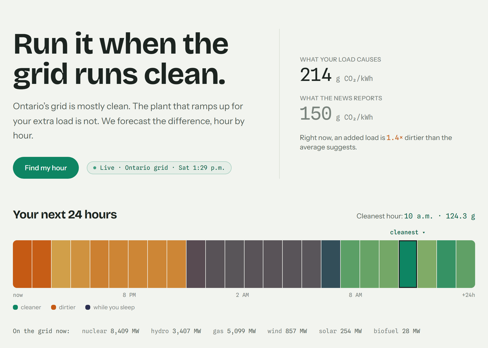
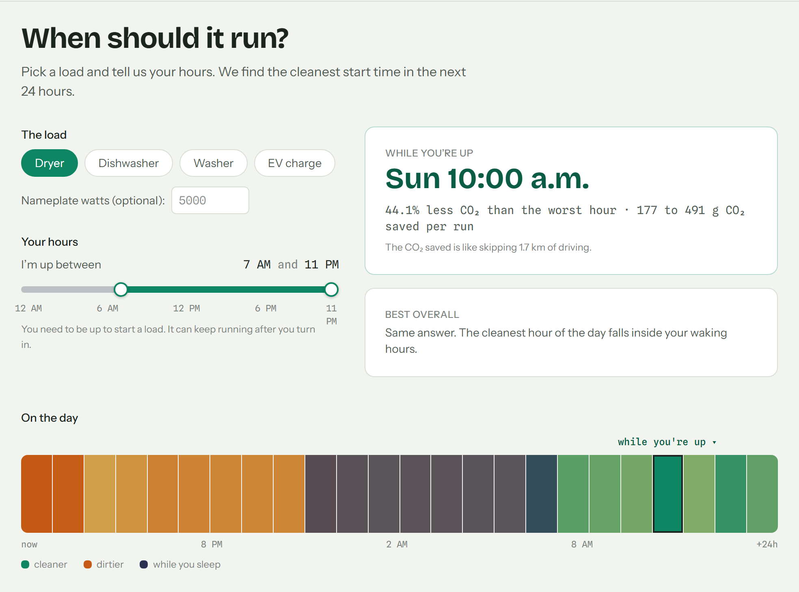

# Loadshift

Loadshift forecasts Ontario's **marginal** carbon intensity 24 hours ahead and
names the cleanest hour to run a deferrable load — a dryer, a dishwasher, an EV
charger.

**Live: https://loadshift-web.onrender.com/**

Built for Ignition Hacks V.7, Environmental track.



## Why marginal, not average

Ontario's grid averages roughly 103 gCO₂eq/kWh — mostly nuclear and hydro. But
nuclear runs flat regardless of demand, so the plant that ramps up to serve one
additional kWh is almost always natural gas at about 490 g. The emissions
*caused* by an appliance are the marginal intensity, not the average.

Across the labelled history the mean marginal intensity is 227 g against a mean
average of 103 g — a 2.2× gap. It also moves through the day in a way the
average does not: hourly mean marginal ranges from 197 g at 6 AM to 271 g at
8 PM, and individual days swing considerably further. That spread is what makes
shifting a load worth anything.

No public feed publishes a marginal forecast for Ontario, so Loadshift derives
one.

## What it does

One scrolling page, four sections.

- **Now** — live marginal intensity beside the average, the multiplier between
  them, the next 24 hours as a colour-scaled band, and the current fuel mix
  in MW.
- **Schedule** — pick an appliance or enter nameplate watts, set the hours
  you're awake, and get two answers: the best start window while you're up, and
  the best overall. Savings are reported as percent CO₂ against the worst window
  the grid offers, plus a gram range and the cost of the run under OEB Regulated
  Price Plan rates (time-of-use and ultra-low overnight).
- **Your data** — upload your own Green Button smart-meter XML, which every
  Ontario utility must provide under O. Reg. 633/21, or use the bundled
  synthetic sample. Returns a year of actual versus optimally-shifted emissions,
  bill savings, a timing score, and evening-peak share. Uploads are parsed in
  memory and never stored.
- **Method** — the model card, emission factors, and limitations, read from the
  artifact at runtime rather than hardcoded.



## How it works

1. **Ingest** — hourly generation by fuel and Ontario demand from
   [IESO Public Reports](https://reports-public.ieso.ca/public/) (no key
   required), joined with Open-Meteo weather at the GTA load centre. 23,112
   hourly rows from 2024-01-01 onward, about 2.6 years, all normalized to UTC.
   IESO reports use fixed Eastern Standard Time year-round and number hours
   1–24; both are handled explicitly and verified against DST transition days.
2. **Label** — there is no marginal-emissions feed to copy, so one is derived
   per Siler-Evans, Azevedo & Morgan (2012, *Environ. Sci. Technol.* 46(9)).
   Within each season × hour-block bucket, regress each fuel's hour-over-hour
   ramp on the demand ramp across overlapping net-demand windows, using
   demand-*increase* hours only, then take MEF = Σ(slope_fuel × EF_fuel) with
   IPCC AR5 lifecycle emission factors.
3. **Forecast** — LightGBM, 24 hours ahead, 14 features, every one of them
   causal at that horizon: calendar, forecast weather, and lags of 24h or more.
   The seasonal-naive baseline was written first so the result would mean
   something.
4. **Optimize** — a sliding-window argmin over the forecast for the appliance's
   run duration. The waking-hours constraint applies to the start hour only, and
   savings are always quoted against the unconstrained worst window.
5. **Serve** — an hourly job rebuilds the forecast and publishes it; the web
   service only reads it. If an upstream feed fails, the last known good
   forecast keeps being served with a visible `stale` flag and the time it was
   built, never an error page.

**Result** — on a chronological 60-day holdout, MAE **13.51 g** against
**23.21 g** for the seasonal-naive baseline: **41.8% better**, R² 0.555.

**External validation** — the independently-computed average intensity tracks
Electricity Maps' published Ontario figure within **2.1 g/kWh** (bias +1.8 g,
correlation 0.91) on the same lifecycle emission-factor basis. Their API is used
once as a cross-check and nothing is built on it.

Assumptions and limitations are stated in [ASSUMPTIONS.md](ASSUMPTIONS.md) — 27
of them, including the largest: intertie flows are unmodelled, so the fuel-slope
regression explains about 78% of a marginal Ontario kWh.

## Getting started

### Requirements

- **Python 3.12** (Render pins 3.12.4; the artifacts were built against the
  pinned dependency versions in `api/requirements.txt`)
- **Node 20+** (developed on 24)
- **No API keys.** Every data source on the main path is public and keyless.

### Quick start

The model is not trained here. `api/artifacts/` ships the trained booster, the
MEF curve, and a weather seed; the refresh job loads them, fetches recent IESO
data and current weather, and writes a 24-hour forecast in a few seconds.

> Commands use the Windows virtualenv layout (`.venv/Scripts/`). On macOS and
> Linux, substitute `.venv/bin/`.

```bash
git clone https://github.com/coltonalmeida/Loadshift.git
cd Loadshift

python -m venv .venv
.venv/Scripts/pip install -r api/requirements-dev.txt

cd api
../.venv/Scripts/python -m loadshift.refresh_job    # build the forecast cache
../.venv/Scripts/python -m uvicorn loadshift.main:app --reload --port 8000
```

Then, in a second terminal:

```bash
cd web
npm install
npm run dev        # http://localhost:3000, talks to localhost:8000 by default
```

Nothing here needs Render, and the frontend needs no environment variables in
development.

### Rebuilding the model from raw data (optional)

Only needed to reproduce the artifacts. Run from `api/`:

```bash
../.venv/Scripts/python scripts/smoke_sources.py   # check all four upstreams respond
../.venv/Scripts/python scripts/build_dataset.py   # -> data/dataset.parquet (~2 min)
../.venv/Scripts/python scripts/fit_mef.py         # -> artifacts/mef_curve.json + mef_history.parquet
../.venv/Scripts/python scripts/train.py           # -> artifacts/model.txt + model_card.json
```

Each script prints its own QA summary — row counts and gaps, bucket fits and
monotonicity, model versus baseline MAE.

Two more scripts exist outside the pipeline:
`make_sample_greenbutton.py` regenerates the synthetic meter files, and
`check_electricitymaps.py` runs the external cross-check (needs
`ELECTRICITYMAPS_TOKEN`).

### Environment variables

All of them are optional locally; every one has a working fallback.

| Variable | Used by | Effect when unset |
|---|---|---|
| `GEMINI_API_KEY` | API, refresh job | The generated report and follow-up questions are unavailable. Every computed number is unaffected, and the UI omits the card. |
| `KV_URL` | API, refresh job | Unset locally by design. Every Key Value call returns `None` and the app falls back to its in-process and on-disk caches. Point it at any Redis-compatible server (`redis://localhost:6379`) to exercise those paths. |
| `ELECTRICITYMAPS_TOKEN` | `scripts/check_electricitymaps.py` | That validation script exits with a message. Nothing else reads it. |
| `NEXT_PUBLIC_API_BASE` | web | Defaults to `http://localhost:8000` in development, same-origin otherwise. |
| `API_HOST`, `API_PORT` | web proxy | Set by Render so `/api/*` reaches the API over the private network. Unused in local development. |

### Tests

```bash
cd api
../.venv/Scripts/python -m pytest tests/ -q
```

63 tests across 6 files, covering the IESO parsers and hour conventions, TOU and
ULO pricing, the weather fallback chain, the insight cache, and the deliberately
simulated case of the durable cache being unreachable. There is no pytest config
file, so run them from `api/`.

## Repository layout

```
api/
  loadshift/
    main.py          FastAPI app, endpoints, and the refresh supervisor
    cache.py         builds the forecast payload; three-tier read path
    refresh_job.py   hourly rebuild entrypoint — the only process that runs the model
    mef.py           marginal emissions factor regression
    model.py         LightGBM features, training, and prediction
    optimize.py      sliding-window search for the cleanest run window
    greenbutton.py   ESPI XML parsing and the year-scale analysis
    pricing.py       OEB time-of-use and ultra-low-overnight costing
    insights.py      report generation and caching
    kv.py            Key Value helpers; every call degrades to None
    ieso.py  weather.py  dataset.py  baseline.py  config.py  ratelimit.py
  scripts/           the offline pipeline (above)
  artifacts/         committed: model.txt, mef_curve.json, model_card.json, weather_seed.json
  data/              gitignored: raw downloads and the on-disk cache tier
  samples/           synthetic Green Button files
  tests/
web/
  app/page.tsx                  the single scrolling page
  app/api/[...path]/route.ts    same-origin proxy to the API
  components/                   DayBand (the 24-hour strip), sections/, data/
  lib/                          typed API client, colour scale, impact equivalents
render.yaml                     the four-resource Render Blueprint
```

## API

| Endpoint | Purpose |
|---|---|
| `GET /api/now` | Current hour: marginal and average intensity, fuel mix in MW, Ontario demand. |
| `GET /api/forecast` | The cached 24-hour forecast: marginal, average, and confidence band per hour. |
| `POST /api/schedule` | Best start window for an appliance — constrained to waking hours, and overall. |
| `POST /api/greenbutton` | Upload Green Button ESPI XML; returns a year of usage and emissions statistics. |
| `GET /api/greenbutton/sample` | The same statistics for the bundled synthetic file. |
| `POST /api/insights/report` | Plain-language report generated from those statistics. |
| `POST /api/insights/ask` | Follow-up question, answered only from those statistics. |
| `GET /api/model-card` | Model metrics, the MEF method and its stated limitation, emission factors. |
| `GET /api/health` | Liveness. Always 200 — a warming instance must not fail its own deploy. |
| `GET /api/ready` | Readiness. 503 when there is genuinely no forecast to serve. |
| `GET /api/platform` | Which service built the forecast being served, when, and on which commit. |

## Deployment

Four Render resources in one Blueprint ([`render.yaml`](render.yaml)):

```
browser ─▶ loadshift-web      (Next.js)       public URL; proxies /api/*
                │                              over Render's private network
                ▼
           loadshift-api      (FastAPI)       reads the cache; never the model
                │
                ▼
           loadshift-cache    (Key Value)     the only tier that survives a deploy
                ▲
                │
           loadshift-refresh  (cron, hourly)  the only process that runs LightGBM
```

All training happens locally and produces small committed artifacts, so the
server never trains and never parses a year of XML. A page load cannot trigger a
forecast rebuild: the cron job publishes to Key Value each hour and the web
service only reads it, so "never run the model on a request path" holds because
of the topology — the web service does not import LightGBM at all.

[DEPLOY.md](DEPLOY.md) covers why the split exists, how each failure mode
degrades, and first-time setup.

## Data sources

- **IESO Public Reports** — hourly generation by fuel, hourly Ontario demand,
  and the live per-generator feed. Public, no key.
- **Open-Meteo** — historical archive for training, forecast for inference. No key.
- **Green Button (O. Reg. 633/21)** — customer smart-meter interval data,
  supplied by the user.
- **Emission factors** — IPCC AR5 WGIII Annex III lifecycle medians.
- **Electricity Maps** — used once to validate, never as a dependency.

## License

MIT — see [LICENSE](LICENSE).
